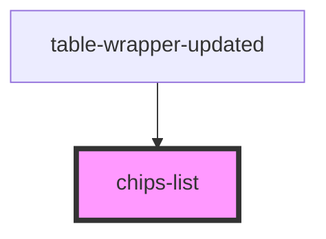

# chips-list

<!-- Auto Generated Below -->

## Properties

| Property           | Attribute            | Description | Type  | Default     |
| ------------------ | -------------------- | ----------- | ----- | ----------- |
| `removeSearchChip` | `remove-search-chip` |             | `any` | `undefined` |
| `removeSortChip`   | `remove-sort-chip`   |             | `any` | `undefined` |
| `searchChips`      | --                   |             | `{}`  | `undefined` |
| `sortchips`        | --                   |             | `{}`  | `undefined` |
| `togglesort`       | `togglesort`         |             | `any` | `undefined` |

## Dependencies

### Used by

 - [table-wrapper-updated](../table-wrapper-updated)

### Graph

----------------------------------------------

*Built with [StencilJS](https://stenciljs.com/)*
