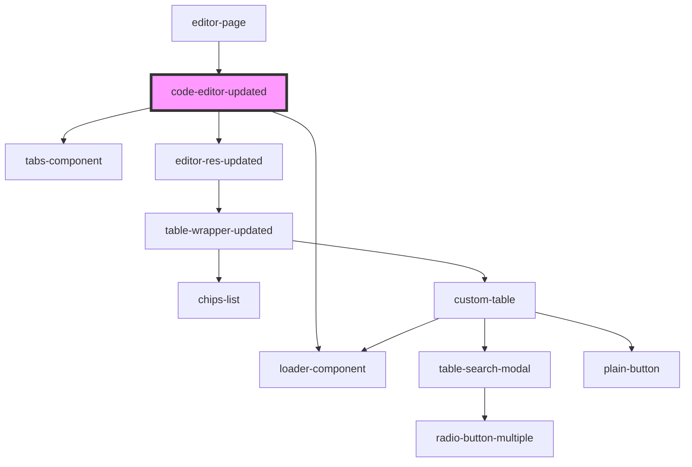

# code-editor-updated

<!-- Auto Generated Below -->

## Properties

| Property       | Attribute       | Description | Type     | Default     |
| -------------- | --------------- | ----------- | -------- | ----------- |
| `doc`          | `doc`           |             | `any`    | `undefined` |
| `docParameter` | `doc-parameter` |             | `any`    | `undefined` |
| `headerList`   | --              |             | `{}[]`   | `[]`        |
| `response`     | `response`      |             | `any`    | `undefined` |
| `url`          | `url`           |             | `string` | `undefined` |

## Dependencies

### Used by

 - [editor-page](../editor-page)

### Depends on

- [tabs-component](../tabs-component)
- [loader-component](../loader-component)
- [editor-res-updated](../editor-res-updated)

### Graph

----------------------------------------------

*Built with [StencilJS](https://stenciljs.com/)*
