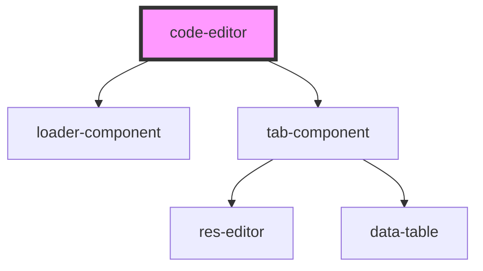

# editor-container

<!-- Auto Generated Below -->

## Properties

| Property | Attribute | Description | Type     | Default     |
| -------- | --------- | ----------- | -------- | ----------- |
| `doc`    | `doc`     |             | `any`    | `'\n\n\n'`  |
| `url`    | `url`     |             | `string` | `undefined` |

## Dependencies

### Depends on

- [loader-component](../loader-component)
- [tab-component](../tab-component)

### Graph

----------------------------------------------

*Built with [StencilJS](https://stenciljs.com/)*
