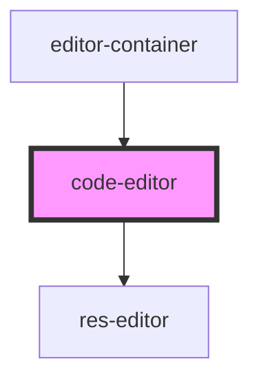

# code-editor

<!-- Auto Generated Below -->

## Properties

| Property              | Attribute     | Description | Type                | Default     |
| --------------------- | ------------- | ----------- | ------------------- | ----------- |
| `doc`                 | `doc`         |             | `any`               | `undefined` |
| `header`              | `header`      |             | `string`            | `undefined` |
| `isEditable`          | `is-editable` |             | `"false" \| "true"` | `'true'`    |
| `language`            | `language`    |             | `"java" \| "json"`  | `'java'`    |
| `runBtn` _(required)_ | `run-btn`     |             | `"off" \| "on"`     | `undefined` |
| `url`                 | `url`         |             | `string`            | `undefined` |

## Dependencies

### Used by

 - [editor-container](../editor-container)

### Depends on

- [res-editor](../res-editor)

### Graph

----------------------------------------------

*Built with [StencilJS](https://stenciljs.com/)*
