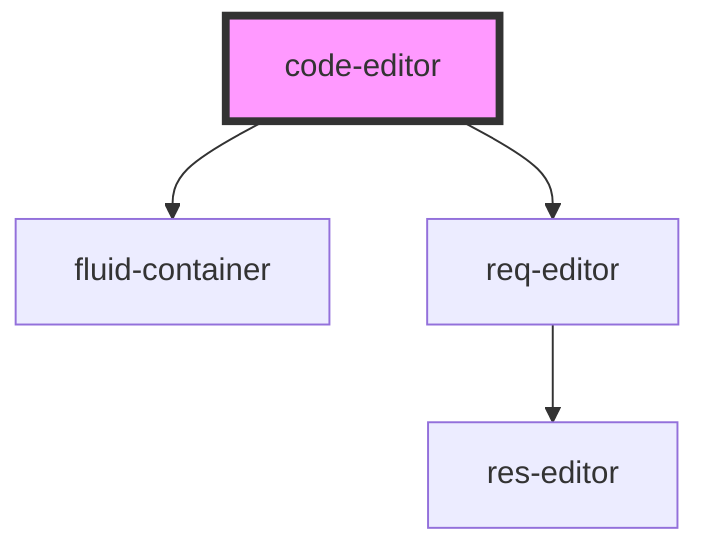

# editor-container

<!-- Auto Generated Below -->

## Properties

| Property     | Attribute     | Description | Type     | Default     |
| ------------ | ------------- | ----------- | -------- | ----------- |
| `headerText` | `header-text` |             | `string` | `undefined` |
| `url`        | `url`         |             | `string` | `undefined` |

## Dependencies

### Depends on

- [fluid-container](../fluid-container)
- [req-editor](../req-editor)

### Graph

----------------------------------------------

*Built with [StencilJS](https://stenciljs.com/)*
