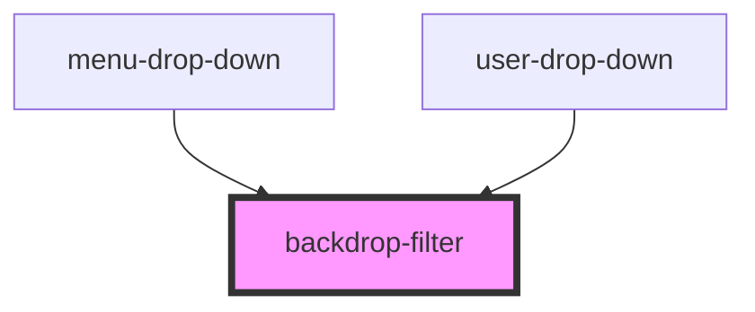

# backdrop-filter

<!-- Auto Generated Below -->

## Properties

| Property          | Attribute           | Description | Type      | Default     |
| ----------------- | ------------------- | ----------- | --------- | ----------- |
| `backDropHandler` | `back-drop-handler` |             | `any`     | `undefined` |
| `showBackDrop`    | `show-back-drop`    |             | `boolean` | `undefined` |

## Dependencies

### Used by

 - [menu-drop-down](../../editorPage/menu-drop-down)
 - [user-drop-down](../../usersPage/user-drop-down)

### Graph

----------------------------------------------

*Built with [StencilJS](https://stenciljs.com/)*
