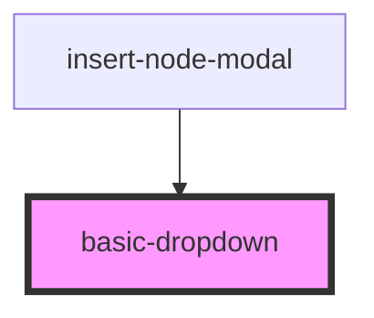

# basic-dropdown

<!-- Auto Generated Below -->

## Properties

| Property                  | Attribute                    | Description | Type     | Default      |
| ------------------------- | ---------------------------- | ----------- | -------- | ------------ |
| `label`                   | `label`                      |             | `string` | `'DropDown'` |
| `optionHandler`           | `option-handler`             |             | `any`    | `undefined`  |
| `propOptions`             | `prop-options`               |             | `any`    | `undefined`  |
| `propSelectedOptionLabel` | `prop-selected-option-label` |             | `string` | `undefined`  |

## Dependencies

### Used by

 - [insert-node-modal](../../editorPage/insert-node-modal)

### Graph

----------------------------------------------

*Built with [StencilJS](https://stenciljs.com/)*
