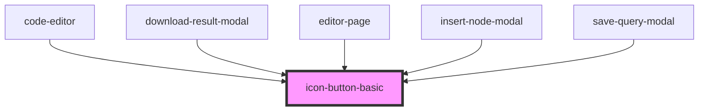

# icon-button-basic

<!-- Auto Generated Below -->

## Properties

| Property       | Attribute       | Description | Type                                     | Default     |
| -------------- | --------------- | ----------- | ---------------------------------------- | ----------- |
| `clickHandler` | `click-handler` |             | `any`                                    | `undefined` |
| `color`        | `color`         |             | `"primary" \| "secondary" \| "tertiary"` | `'primary'` |
| `customClass`  | `custom-class`  |             | `string`                                 | `''`        |
| `disabled`     | `disabled`      |             | `boolean`                                | `false`     |
| `icon`         | `icon`          |             | `any`                                    | `undefined` |
| `loading`      | `loading`       |             | `boolean`                                | `false`     |
| `size`         | `size`          |             | `"lg" \| "md" \| "sm"`                   | `'sm'`      |
| `title`        | `title`         |             | `string`                                 | `null`      |
| `type`         | `type`          |             | `"button" \| "submit"`                   | `'button'`  |
| `width`        | `width`         |             | `"auto" \| "full"`                       | `'auto'`    |

## Dependencies

### Used by

 - [code-editor](../../../editorPage/code-editor)
 - [download-result-modal](../../../editorPage/download-result-modal)
 - [editor-page](../../../editorPage/editor-page)
 - [insert-node-modal](../../../editorPage/insert-node-modal)
 - [save-query-modal](../../../editorPage/save-query-modal)

### Graph

----------------------------------------------

*Built with [StencilJS](https://stenciljs.com/)*
