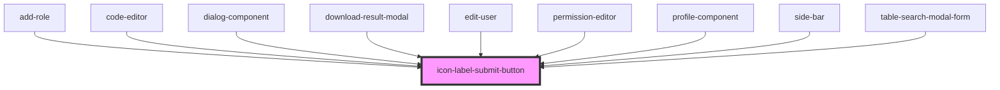

# icon-label-submit-button

<!-- Auto Generated Below -->

## Properties

| Property       | Attribute       | Description | Type                                     | Default       |
| -------------- | --------------- | ----------- | ---------------------------------------- | ------------- |
| `clickHandler` | `click-handler` |             | `any`                                    | `undefined`   |
| `color`        | `color`         |             | `"primary" \| "secondary" \| "tertiary"` | `'primary'`   |
| `customClass`  | `custom-class`  |             | `string`                                 | `''`          |
| `disabled`     | `disabled`      |             | `boolean`                                | `false`       |
| `endIcon`      | `end-icon`      |             | `any`                                    | `undefined`   |
| `loading`      | `loading`       |             | `boolean`                                | `false`       |
| `size`         | `size`          |             | `"lg" \| "md" \| "sm"`                   | `'sm'`        |
| `startIcon`    | `start-icon`    |             | `any`                                    | `undefined`   |
| `title`        | `title`         |             | `string`                                 | `null`        |
| `type`         | `type`          |             | `"button" \| "submit"`                   | `'button'`    |
| `varient`      | `varient`       |             | `"contained" \| "outlined" \| "text"`    | `'contained'` |
| `width`        | `width`         |             | `"auto" \| "full"`                       | `'auto'`      |

## Dependencies

### Used by

 - [add-role](../../../permissionPage/add-role)
 - [code-editor](../../../editorPage/code-editor)
 - [dialog-component](../../../usersPage/dialog-component)
 - [download-result-modal](../../../editorPage/download-result-modal)
 - [edit-user](../../../usersPage/edit-user)
 - [permission-editor](../../../permissionPage/permission-editor)
 - [profile-component](../../../profilePage/profile-component)
 - [side-bar](../../../settingsPage/side-bar)
 - [table-search-modal-form](../../../editorPage/table-search-modal-form)

### Graph

----------------------------------------------

*Built with [StencilJS](https://stenciljs.com/)*
