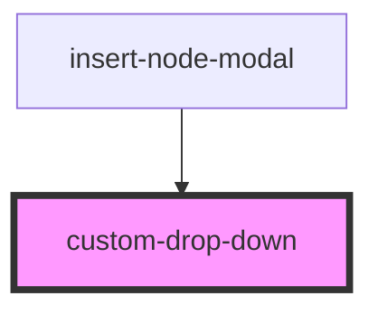

# custom-drop-down

<!-- Auto Generated Below -->

## Properties

| Property         | Attribute         | Description | Type                                      | Default                                                                                    |
| ---------------- | ----------------- | ----------- | ----------------------------------------- | ------------------------------------------------------------------------------------------ |
| `dropDownValue`  | `drop-down-value` |             | `string`                                  | `undefined`                                                                                |
| `optionListProp` | --                |             | `{ label: string; selected: boolean; }[]` | `[     { label: 'Durga', selected: false },     { label: 'Phukan', selected: false },   ]` |
| `selectHandler`  | `select-handler`  |             | `any`                                     | `undefined`                                                                                |

## Dependencies

### Used by

 - [insert-node-modal](../../editorPage/insert-node-modal)

### Graph

----------------------------------------------

*Built with [StencilJS](https://stenciljs.com/)*
