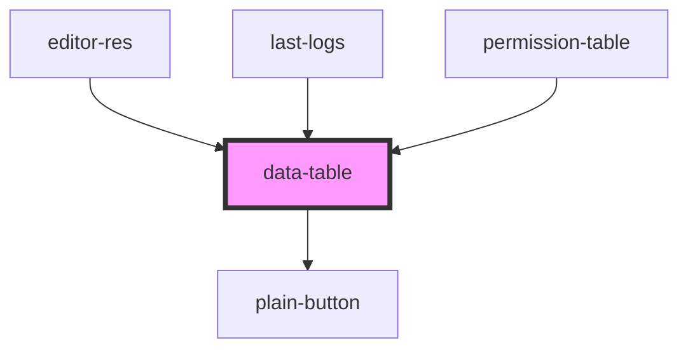

# data-table

<!-- Auto Generated Below -->

## Properties

| Property         | Attribute         | Description | Type                                                                                                                                                                                                                                                                                                                                                                                                                                                                                                                                                                                                                                                                                                                                                      | Default     |
| ---------------- | ----------------- | ----------- | --------------------------------------------------------------------------------------------------------------------------------------------------------------------------------------------------------------------------------------------------------------------------------------------------------------------------------------------------------------------------------------------------------------------------------------------------------------------------------------------------------------------------------------------------------------------------------------------------------------------------------------------------------------------------------------------------------------------------------------------------------- | ----------- |
| `columns`        | --                |             | `{ id: string \| number; key: string; name: string; type: "string" \| "number" \| "date" \| "datetime"; prefix?: string; suffix?: string; maxChar?: number; decimal?: boolean; decimalPlaces?: number; seperator?: string; isSortable: boolean; isFilterable: boolean; isEditable: boolean; isDeletable: boolean; onSort?: (key: string) => Promise<void>; onFilter?: (column: any) => Promise<void>; onRowClick?: (id: string \| number, key: string, value: any) => Promise<void>; customColumnComponent?: (name: string) => any; customRowComponent?: (value: any) => any; customStyle?: { headerStyle?: { [index: string]: string \| number; }; headerClass?: string; cellStyle?: { [index: string]: string \| number; }; cellClass?: string; }; }[]` | `[]`        |
| `customClass`    | `custom-class`    |             | `string`                                                                                                                                                                                                                                                                                                                                                                                                                                                                                                                                                                                                                                                                                                                                                  | `undefined` |
| `customStyle`    | --                |             | `{ [style: string]: string \| number; }`                                                                                                                                                                                                                                                                                                                                                                                                                                                                                                                                                                                                                                                                                                                  | `undefined` |
| `data`           | --                |             | `any[]`                                                                                                                                                                                                                                                                                                                                                                                                                                                                                                                                                                                                                                                                                                                                                   | `[]`        |
| `limit`          | `limit`           |             | `number`                                                                                                                                                                                                                                                                                                                                                                                                                                                                                                                                                                                                                                                                                                                                                  | `10`        |
| `onDelete`       | --                |             | `(index: number, row: { [field: string]: string \| number \| Date; }) => Promise<any>`                                                                                                                                                                                                                                                                                                                                                                                                                                                                                                                                                                                                                                                                    | `undefined` |
| `onEdit`         | --                |             | `(index: number, changes: { prevValue: string \| number \| Date; newValue: string \| number \| Date; name: string; }[]) => Promise<any>`                                                                                                                                                                                                                                                                                                                                                                                                                                                                                                                                                                                                                  | `undefined` |
| `onPaginate`     | --                |             | `(tcurrentPage: number, limit: number) => Promise<void>`                                                                                                                                                                                                                                                                                                                                                                                                                                                                                                                                                                                                                                                                                                  | `undefined` |
| `page`           | `page`            |             | `number`                                                                                                                                                                                                                                                                                                                                                                                                                                                                                                                                                                                                                                                                                                                                                  | `1`         |
| `showActions`    | `show-actions`    |             | `boolean`                                                                                                                                                                                                                                                                                                                                                                                                                                                                                                                                                                                                                                                                                                                                                 | `false`     |
| `showPagination` | `show-pagination` |             | `boolean`                                                                                                                                                                                                                                                                                                                                                                                                                                                                                                                                                                                                                                                                                                                                                 | `false`     |
| `supportedLimit` | --                |             | `number[]`                                                                                                                                                                                                                                                                                                                                                                                                                                                                                                                                                                                                                                                                                                                                                | `[]`        |
| `total`          | `total`           |             | `number`                                                                                                                                                                                                                                                                                                                                                                                                                                                                                                                                                                                                                                                                                                                                                  | `0`         |

## Dependencies

### Used by

 - [editor-res](../../../editorPage/editor-res)
 - [last-logs](../../../userProfilePage/last-logs)
 - [permission-table](../../../userProfilePage/permission-table)

### Depends on

- [plain-button](../../plain-button)

### Graph

----------------------------------------------

*Built with [StencilJS](https://stenciljs.com/)*
