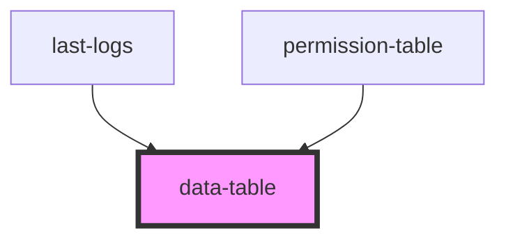

# data-table

<!-- Auto Generated Below -->

## Properties

| Property      | Attribute      | Description | Type                                                                                                                                                                                                                                                                                                                                                                                                                                                                                                                                                                                                                                                                                                                                                                                                    | Default     |
| ------------- | -------------- | ----------- | ------------------------------------------------------------------------------------------------------------------------------------------------------------------------------------------------------------------------------------------------------------------------------------------------------------------------------------------------------------------------------------------------------------------------------------------------------------------------------------------------------------------------------------------------------------------------------------------------------------------------------------------------------------------------------------------------------------------------------------------------------------------------------------------------------- | ----------- |
| `columns`     | --             |             | `{ id: string \| number; key: string; name: string; type: "string" \| "number" \| "date" \| "datetime"; prefix?: string; suffix?: string; maxChar?: number; decimal?: boolean; decimalPlaces?: number; seperator?: string; isSortable: boolean; isFilterable: boolean; isEditable: boolean; isDeletable: boolean; onSort?: (id: string \| number, name: string) => Promise<void>; onFilter?: (id: string \| number, name: string) => Promise<void>; onRowClick?: (id: string \| number, key: string, value: any) => Promise<void>; customColumnComponent?: (name: string) => any; customRowComponent?: (value: any) => any; customStyle?: { headerStyle?: { [index: string]: string \| number; }; headerClass?: string; cellStyle?: { [index: string]: string \| number; }; cellClass?: string; }; }[]` | `[]`        |
| `data`        | --             |             | `any[]`                                                                                                                                                                                                                                                                                                                                                                                                                                                                                                                                                                                                                                                                                                                                                                                                 | `[]`        |
| `onDelete`    | --             |             | `(index: number, row: { [field: string]: string \| number \| Date; }) => Promise<any>`                                                                                                                                                                                                                                                                                                                                                                                                                                                                                                                                                                                                                                                                                                                  | `undefined` |
| `onEdit`      | --             |             | `(index: number, changes: { prevValue: string \| number \| Date; newValue: string \| number \| Date; name: string; }[]) => Promise<any>`                                                                                                                                                                                                                                                                                                                                                                                                                                                                                                                                                                                                                                                                | `undefined` |
| `showActions` | `show-actions` |             | `boolean`                                                                                                                                                                                                                                                                                                                                                                                                                                                                                                                                                                                                                                                                                                                                                                                               | `false`     |

## Dependencies

### Used by

 - [last-logs](../../../userProfilePage/last-logs)
 - [permission-table](../../../userProfilePage/permission-table)

### Graph

----------------------------------------------

*Built with [StencilJS](https://stenciljs.com/)*
