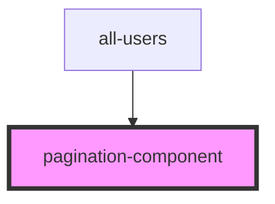

# pagination-component

<!-- Auto Generated Below -->

## Properties

| Property          | Attribute    | Description | Type       | Default     |
| ----------------- | ------------ | ----------- | ---------- | ----------- |
| `jumpPageHandler` | --           |             | `Function` | `undefined` |
| `limit`           | `limit`      |             | `number`   | `undefined` |
| `loading`         | `loading`    |             | `boolean`  | `undefined` |
| `nextHandler`     | --           |             | `Function` | `undefined` |
| `offset`          | `offset`     |             | `number`   | `undefined` |
| `prevHandler`     | --           |             | `Function` | `undefined` |
| `totalData`       | `total-data` |             | `number`   | `undefined` |
| `url`             | `url`        |             | `string`   | `undefined` |

## Dependencies

### Used by

 - [all-users](../../usersPage/all-users)

### Graph

----------------------------------------------

*Built with [StencilJS](https://stenciljs.com/)*
