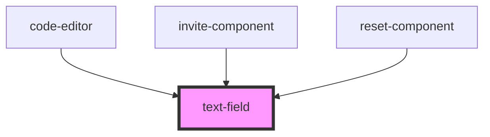

# text-field

<!-- Auto Generated Below -->

## Properties

| Property      | Attribute     | Description | Type                                          | Default     |
| ------------- | ------------- | ----------- | --------------------------------------------- | ----------- |
| `addClass`    | `add-class`   |             | `string`                                      | `undefined` |
| `eye`         | `eye`         |             | `boolean`                                     | `undefined` |
| `name`        | `name`        |             | `string`                                      | `undefined` |
| `onChange`    | `on-change`   |             | `any`                                         | `undefined` |
| `onClick`     | `on-click`    |             | `any`                                         | `undefined` |
| `placeholder` | `placeholder` |             | `string`                                      | `undefined` |
| `type`        | `type`        |             | `"email" \| "password" \| "search" \| "text"` | `'text'`    |

## Dependencies

### Used by

 - [code-editor](../../editorPage/code-editor)
 - [invite-component](../../invitationPage/invite-component)
 - [reset-component](../../resetPasswordPage/reset-component)

### Graph

----------------------------------------------

*Built with [StencilJS](https://stenciljs.com/)*
