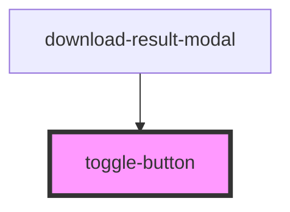

# toggle-button

<!-- Auto Generated Below -->

## Properties

| Property              | Attribute               | Description | Type     | Default     |
| --------------------- | ----------------------- | ----------- | -------- | ----------- |
| `selectedOption`      | `selected-option`       |             | `string` | `'csv'`     |
| `toggleButtonHandler` | `toggle-button-handler` |             | `any`    | `undefined` |

## Dependencies

### Used by

 - [download-result-modal](../../editorPage/download-result-modal)

### Graph

----------------------------------------------

*Built with [StencilJS](https://stenciljs.com/)*
