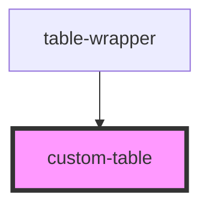

# custom-table

<!-- Auto Generated Below -->

## Properties

| Property      | Attribute      | Description | Type       | Default     |
| ------------- | -------------- | ----------- | ---------- | ----------- |
| `currentPage` | `current-page` |             | `string`   | `undefined` |
| `onClick`     | `on-click`     |             | `any`      | `undefined` |
| `tableBody`   | --             |             | `object[]` | `undefined` |
| `tableHeader` | --             |             | `string[]` | `undefined` |

## Dependencies

### Used by

 - [table-wrapper](../table-wrapper)

### Graph

----------------------------------------------

*Built with [StencilJS](https://stenciljs.com/)*
