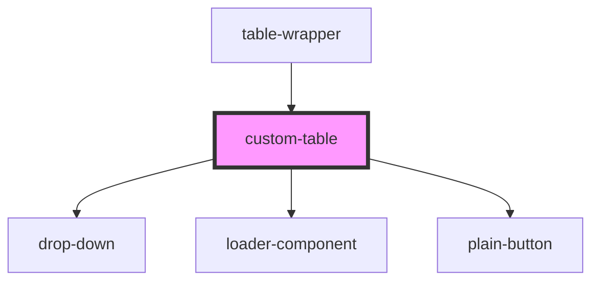

# custom-table

<!-- Auto Generated Below -->

## Properties

| Property           | Attribute            | Description | Type       | Default     |
| ------------------ | -------------------- | ----------- | ---------- | ----------- |
| `clearSearch`      | `clear-search`       |             | `any`      | `undefined` |
| `currentPage`      | `current-page`       |             | `number`   | `undefined` |
| `dataLength`       | `data-length`        |             | `string`   | `undefined` |
| `isLoading`        | `is-loading`         |             | `boolean`  | `undefined` |
| `isLoadingError`   | `is-loading-error`   |             | `boolean`  | `undefined` |
| `limit`            | `limit`              |             | `number`   | `undefined` |
| `next`             | `next`               |             | `any`      | `undefined` |
| `prev`             | `prev`               |             | `any`      | `undefined` |
| `rows`             | --                   |             | `number[]` | `undefined` |
| `rowsHandler`      | `rows-handler`       |             | `any`      | `undefined` |
| `searchMethod`     | `search-method`      |             | `any`      | `undefined` |
| `tableBody`        | --                   |             | `object[]` | `undefined` |
| `tableHeader`      | --                   |             | `object[]` | `undefined` |
| `toggleSortMethod` | `toggle-sort-method` |             | `any`      | `undefined` |

## Dependencies

### Used by

 - [table-wrapper](../table-wrapper)

### Depends on

- [drop-down](../drop-down)
- [loader-component](../loader-component)
- [plain-button](../plain-button)

### Graph

----------------------------------------------

*Built with [StencilJS](https://stenciljs.com/)*
