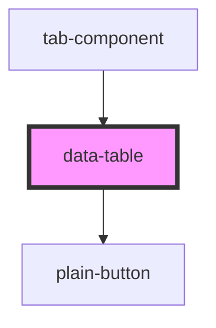

# data-table

<!-- Auto Generated Below -->

## Properties

| Property | Attribute | Description | Type       | Default     |
| -------- | --------- | ----------- | ---------- | ----------- |
| `doc`    | --        |             | `object[]` | `undefined` |

## Dependencies

### Used by

 - [tab-component](../tab-component)

### Depends on

- [plain-button](../plain-button)

### Graph

----------------------------------------------

*Built with [StencilJS](https://stenciljs.com/)*
