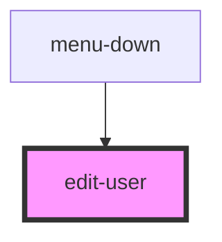

# edit-user

<!-- Auto Generated Below -->

## Properties

| Property      | Attribute     | Description | Type         | Default     |
| ------------- | ------------- | ----------- | ------------ | ----------- |
| `ismodelopen` | `ismodelopen` |             | `boolean`    | `undefined` |
| `submiturl`   | `submiturl`   |             | `string`     | `undefined` |
| `toggle`      | --            |             | `() => void` | `undefined` |
| `url`         | `url`         |             | `string`     | `undefined` |
| `userid`      | `userid`      |             | `number`     | `undefined` |
| `value`       | `value`       |             | `string`     | `undefined` |

## Dependencies

### Used by

 - [menu-down](../menu-down)

### Graph

----------------------------------------------

*Built with [StencilJS](https://stenciljs.com/)*
