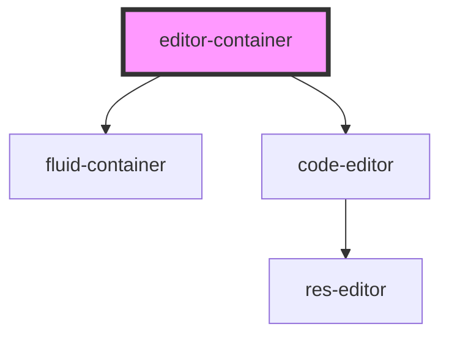

# editor-container

<!-- Auto Generated Below -->

## Dependencies

### Depends on

- [fluid-container](../fluid-container)
- [code-editor](../code-editor)

### Graph

----------------------------------------------

*Built with [StencilJS](https://stenciljs.com/)*
