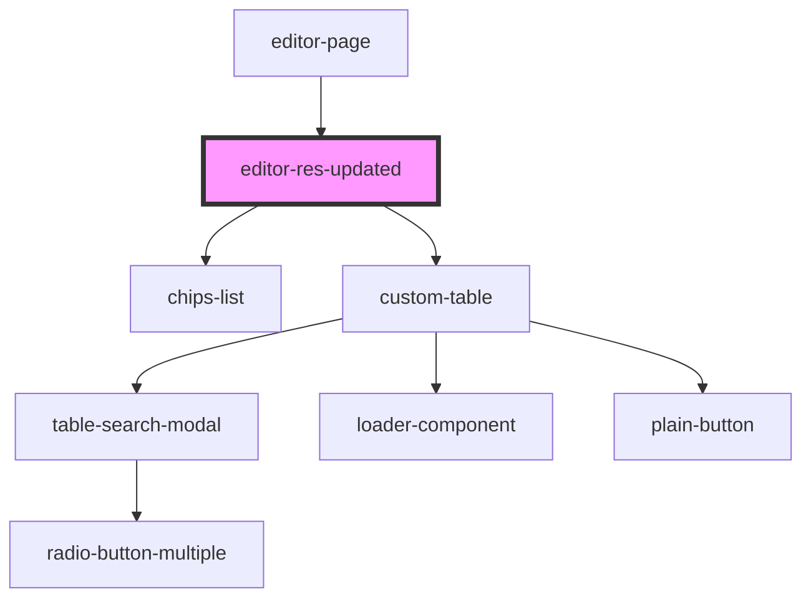

# editor-res-updated

<!-- Auto Generated Below -->

## Properties

| Property           | Attribute            | Description | Type       | Default     |
| ------------------ | -------------------- | ----------- | ---------- | ----------- |
| `autocompute`      | `autocompute`        |             | `boolean`  | `undefined` |
| `errorMessage`     | `error-message`      |             | `string`   | `undefined` |
| `headerList`       | --                   |             | `object[]` | `undefined` |
| `isLoading`        | `is-loading`         |             | `boolean`  | `undefined` |
| `nodeData`         | --                   |             | `object[]` | `undefined` |
| `onTableOperation` | `on-table-operation` |             | `any`      | `undefined` |
| `rowPerPage`       | --                   |             | `number[]` | `undefined` |

## Dependencies

### Used by

 - [editor-page](../editor-page)

### Depends on

- [chips-list](../chips-list)
- [custom-table](../custom-table)

### Graph

----------------------------------------------

*Built with [StencilJS](https://stenciljs.com/)*
