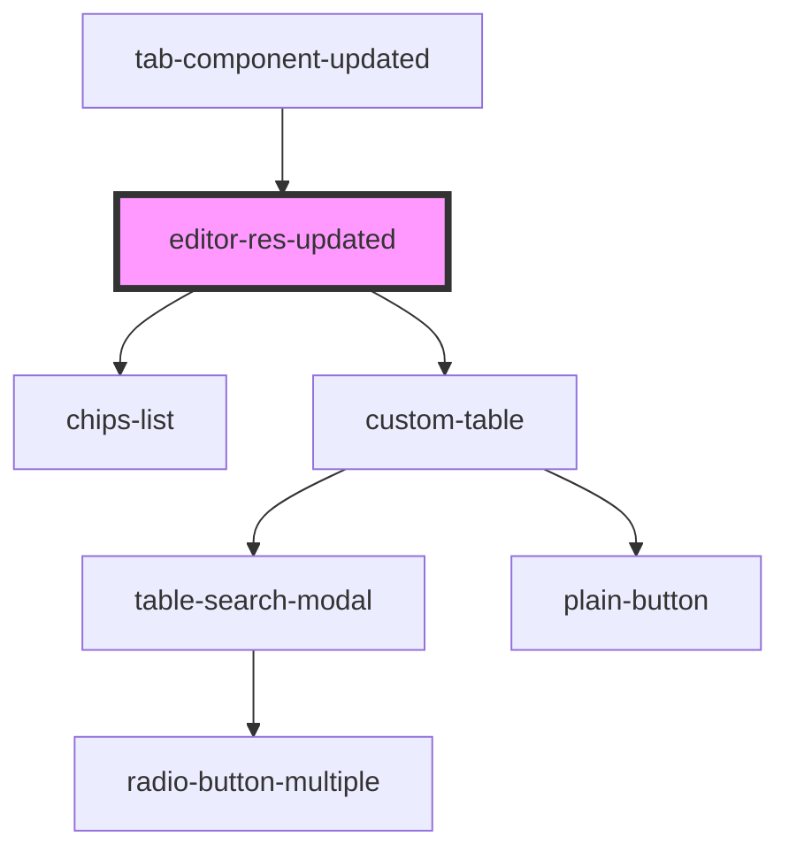

# editor-res-updated

<!-- Auto Generated Below -->

## Dependencies

### Used by

 - [tab-component-updated](../tab-component-updated)

### Depends on

- [chips-list](../chips-list)
- [custom-table](../custom-table)

### Graph

----------------------------------------------

*Built with [StencilJS](https://stenciljs.com/)*
