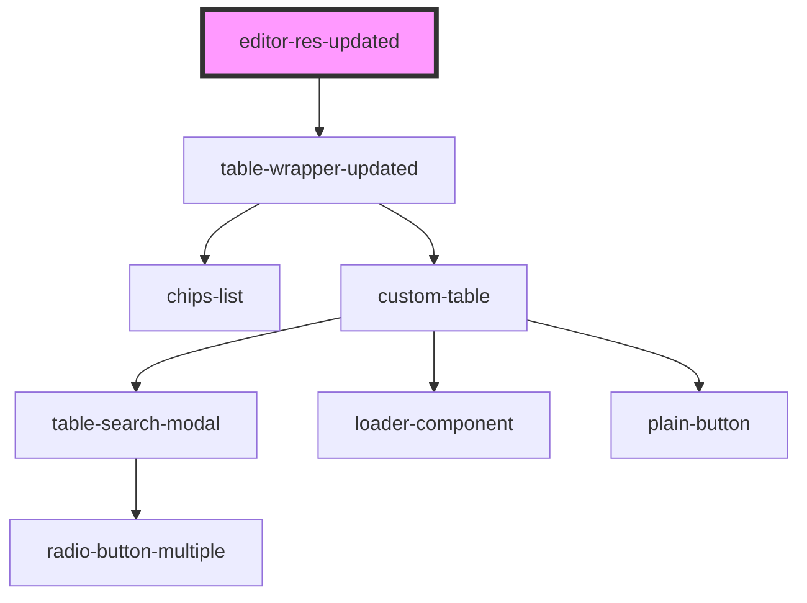

# editor-res-updated

<!-- Auto Generated Below -->

## Properties

| Property     | Attribute     | Description | Type  | Default     |
| ------------ | ------------- | ----------- | ----- | ----------- |
| `headerList` | `header-list` |             | `any` | `undefined` |
| `result`     | `result`      |             | `any` | `undefined` |

## Dependencies

### Depends on

- [table-wrapper-updated](../table-wrapper-updated)

### Graph

----------------------------------------------

*Built with [StencilJS](https://stenciljs.com/)*
