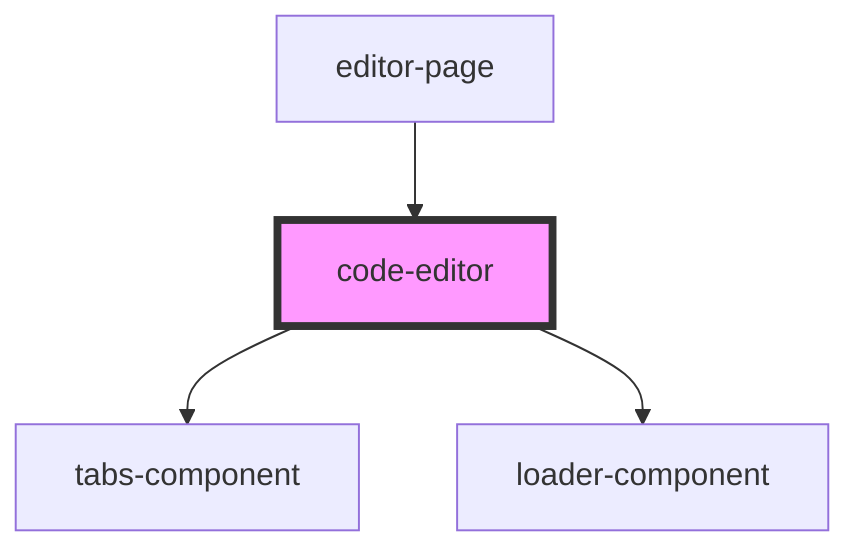

# code-editor

<!-- Auto Generated Below -->

## Properties

| Property     | Attribute | Description | Type       | Default     |
| ------------ | --------- | ----------- | ---------- | ----------- |
| `formatter`  | --        |             | `Function` | `undefined` |
| `onClickRun` | --        |             | `Function` | `undefined` |

## Dependencies

### Used by

 - [editor-page](../editor-page)

### Depends on

- [tabs-component](../tabs-component)
- [loader-component](../../common/loader-component)

### Graph

----------------------------------------------

*Built with [StencilJS](https://stenciljs.com/)*
