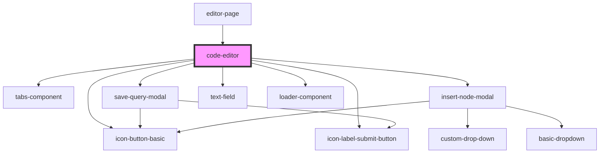

# code-editor

<!-- Auto Generated Below -->

## Properties

| Property          | Attribute | Description | Type       | Default     |
| ----------------- | --------- | ----------- | ---------- | ----------- |
| `fetchNavigators` | --        |             | `Function` | `undefined` |
| `formatter`       | --        |             | `Function` | `undefined` |
| `onClickRun`      | --        |             | `Function` | `undefined` |

## Dependencies

### Used by

 - [editor-page](../editor-page)

### Depends on

- [tabs-component](../tabs-component)
- [save-query-modal](../save-query-modal)
- [insert-node-modal](../insert-node-modal)
- [icon-button-basic](../../common/buttons/icon-button-basic)
- [icon-label-submit-button](../../common/buttons/icon-label-submit-button)
- [text-field](../../common/text-field)
- [loader-component](../../common/loader-component)

### Graph

----------------------------------------------

*Built with [StencilJS](https://stenciljs.com/)*
