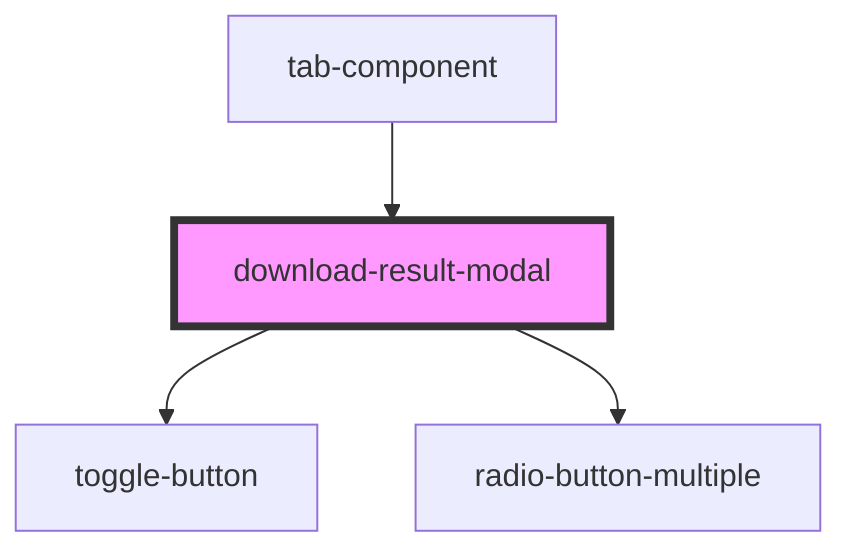

# download-result-modal

<!-- Auto Generated Below -->

## Dependencies

### Used by

 - [tab-component](../tab-component)

### Depends on

- [toggle-button](../../common/toggle-button)
- [radio-button-multiple](../../common/radio-button-multiple)

### Graph

----------------------------------------------

*Built with [StencilJS](https://stenciljs.com/)*
