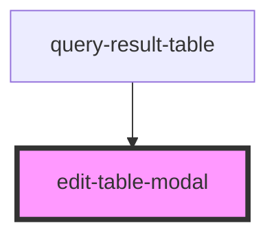

# edit-table-modal

<!-- Auto Generated Below -->

## Properties

| Property           | Attribute            | Description | Type      | Default     |
| ------------------ | -------------------- | ----------- | --------- | ----------- |
| `isModalOpen`      | `is-modal-open`      |             | `boolean` | `false`     |
| `toggleModalState` | `toggle-modal-state` |             | `any`     | `undefined` |

## Dependencies

### Used by

 - [query-result-table](../query-result-table)

### Graph

----------------------------------------------

*Built with [StencilJS](https://stenciljs.com/)*
