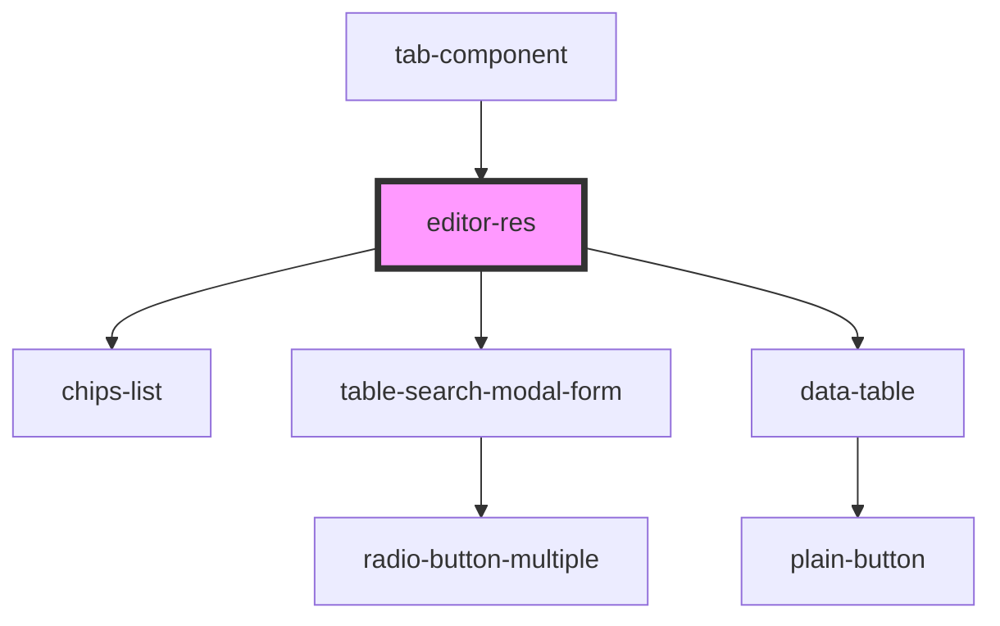

# editor-res

<!-- Auto Generated Below -->

## Dependencies

### Used by

 - [tab-component](../tab-component)

### Depends on

- [chips-list](../chips-list)
- [table-search-modal-form](../table-search-modal-form)
- [data-table](../../common/items/data-table)

### Graph

----------------------------------------------

*Built with [StencilJS](https://stenciljs.com/)*
