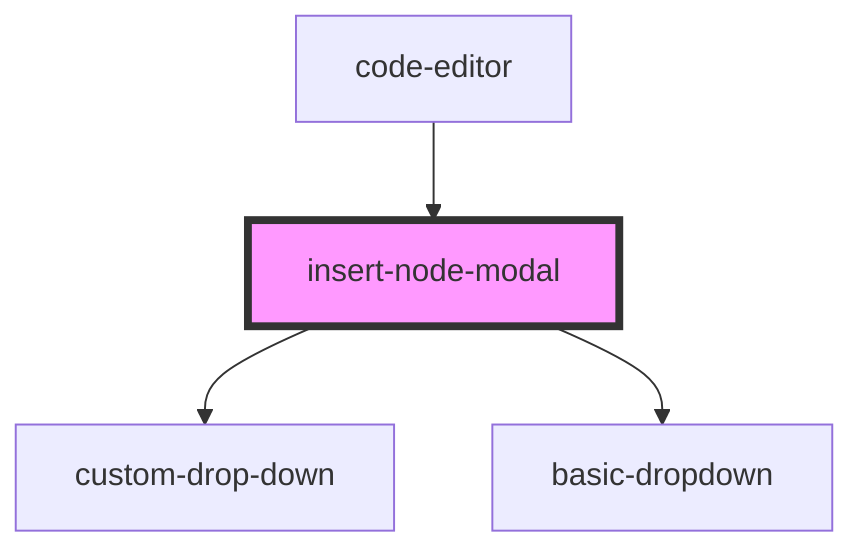

# insert-node-modal

<!-- Auto Generated Below -->

## Properties

| Property          | Attribute | Description | Type       | Default     |
| ----------------- | --------- | ----------- | ---------- | ----------- |
| `fetchNavigators` | --        |             | `Function` | `undefined` |

## Dependencies

### Used by

 - [code-editor](../code-editor)

### Depends on

- [custom-drop-down](../../common/custom-drop-down)
- [basic-dropdown](../../common/basic-dropdown)

### Graph

----------------------------------------------

*Built with [StencilJS](https://stenciljs.com/)*
