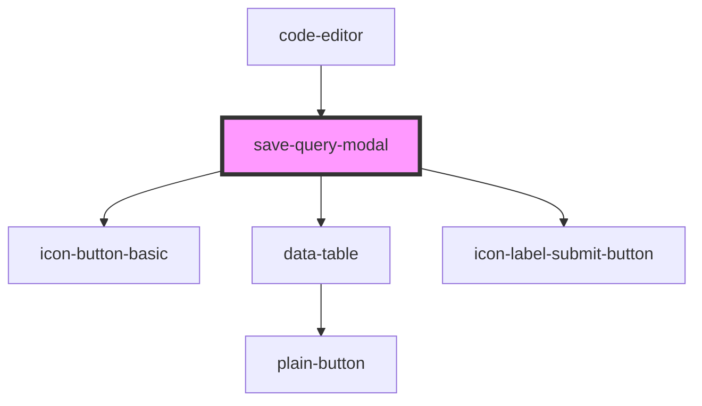

# save-query-modal

<!-- Auto Generated Below -->

## Properties

| Property           | Attribute | Description | Type                         | Default     |
| ------------------ | --------- | ----------- | ---------------------------- | ----------- |
| `deleteQueryData`  | --        |             | `(deleteId: number) => void` | `undefined` |
| `queryDataFetcher` | --        |             | `() => Promise<void>`        | `undefined` |

## Dependencies

### Used by

 - [code-editor](../code-editor)

### Depends on

- [icon-button-basic](../../common/buttons/icon-button-basic)
- [data-table](../../common/items/data-table)
- [icon-label-submit-button](../../common/buttons/icon-label-submit-button)

### Graph

----------------------------------------------

*Built with [StencilJS](https://stenciljs.com/)*
