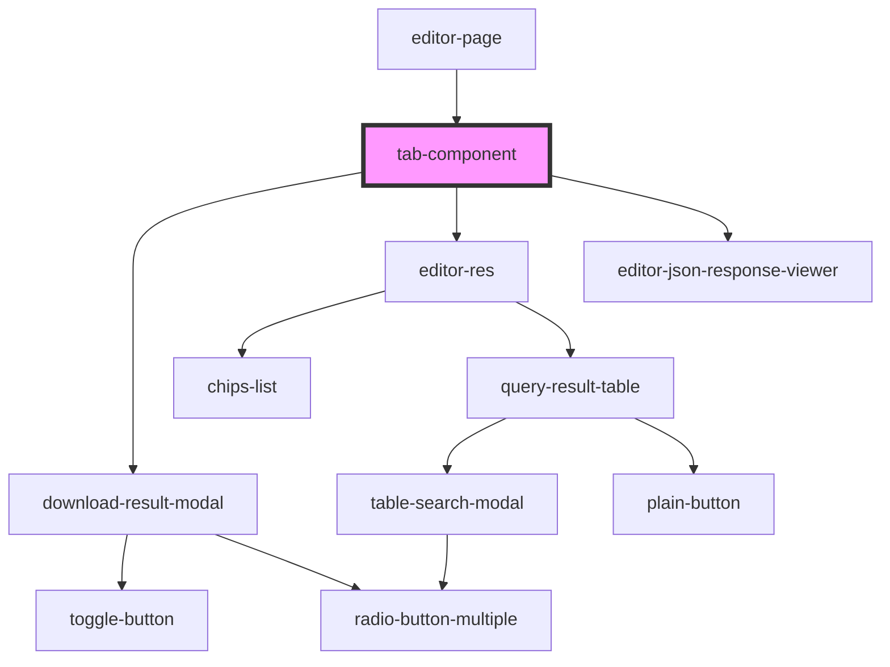

# tab-component

<!-- Auto Generated Below -->

## Dependencies

### Used by

 - [editor-page](../editor-page)

### Depends on

- [download-result-modal](../download-result-modal)
- [editor-res](../editor-res)
- [editor-json-response-viewer](../editor-json-response-viewer)

### Graph

----------------------------------------------

*Built with [StencilJS](https://stenciljs.com/)*
