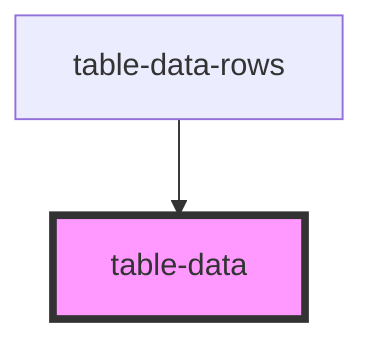

# table-data

<!-- Auto Generated Below -->

## Properties

| Property        | Attribute        | Description | Type      | Default     |
| --------------- | ---------------- | ----------- | --------- | ----------- |
| `dataFormatter` | `data-formatter` |             | `any`     | `undefined` |
| `dataId`        | `data-id`        |             | `any`     | `undefined` |
| `editMode`      | `edit-mode`      |             | `boolean` | `undefined` |
| `fieldName`     | `field-name`     |             | `string`  | `undefined` |
| `item`          | --               |             | `{}`      | `undefined` |
| `rowId`         | `row-id`         |             | `number`  | `undefined` |

## Dependencies

### Used by

 - [table-data-rows](../table-data-rows)

### Graph

----------------------------------------------

*Built with [StencilJS](https://stenciljs.com/)*
