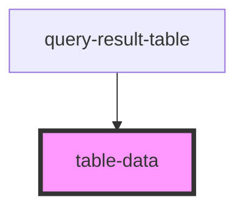

# table-data

<!-- Auto Generated Below -->

## Properties

| Property        | Attribute        | Description | Type  | Default     |
| --------------- | ---------------- | ----------- | ----- | ----------- |
| `dataFormatter` | `data-formatter` |             | `any` | `undefined` |
| `dataId`        | `data-id`        |             | `any` | `undefined` |
| `item`          | --               |             | `{}`  | `undefined` |

## Dependencies

### Used by

 - [query-result-table](../query-result-table)

### Graph

----------------------------------------------

*Built with [StencilJS](https://stenciljs.com/)*
