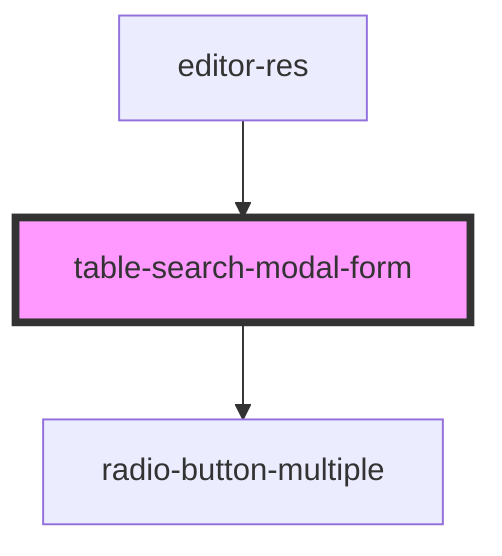

# table-search-modal-form

<!-- Auto Generated Below -->

## Properties

| Property           | Attribute       | Description | Type         | Default     |
| ------------------ | --------------- | ----------- | ------------ | ----------- |
| `alias`            | `alias`         |             | `string`     | `'name'`    |
| `closeSearchModal` | --              |             | `() => void` | `undefined` |
| `refresh`          | `refresh`       |             | `any`        | `undefined` |
| `searchMethod`     | `search-method` |             | `any`        | `undefined` |
| `type`             | `type`          |             | `string`     | `'string'`  |

## Dependencies

### Used by

 - [editor-res](../editor-res)

### Depends on

- [radio-button-multiple](../../common/radio-button-multiple)

### Graph

----------------------------------------------

*Built with [StencilJS](https://stenciljs.com/)*
