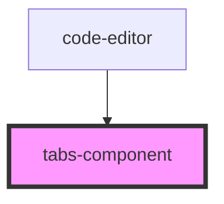

# tabs-component

<!-- Auto Generated Below -->

## Properties

| Property          | Attribute           | Description | Type                                     | Default     |
| ----------------- | ------------------- | ----------- | ---------------------------------------- | ----------- |
| `activeIndex`     | `active-index`      |             | `number`                                 | `undefined` |
| `tabClickHandler` | `tab-click-handler` |             | `any`                                    | `undefined` |
| `tabslist`        | --                  |             | `{ name: string; className: string; }[]` | `undefined` |

## Dependencies

### Used by

 - [code-editor](../code-editor)

### Graph

----------------------------------------------

*Built with [StencilJS](https://stenciljs.com/)*
