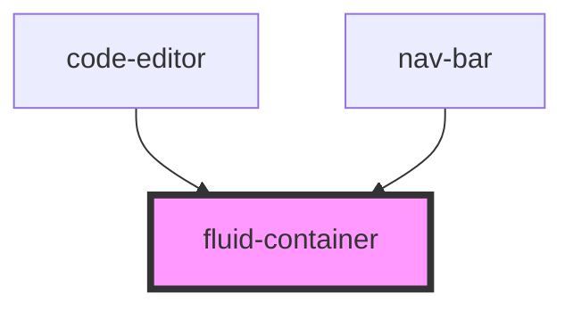

# fluid-container

<!-- Auto Generated Below -->

## Properties

| Property     | Attribute    | Description | Type                   | Default |
| ------------ | ------------ | ----------- | ---------------------- | ------- |
| `breakpoint` | `breakpoint` |             | `"lg" \| "md" \| "xl"` | `'lg'`  |

## Dependencies

### Used by

 - [code-editor](../code-editor)
 - [nav-bar](../nav-bar)

### Graph

----------------------------------------------

*Built with [StencilJS](https://stenciljs.com/)*
