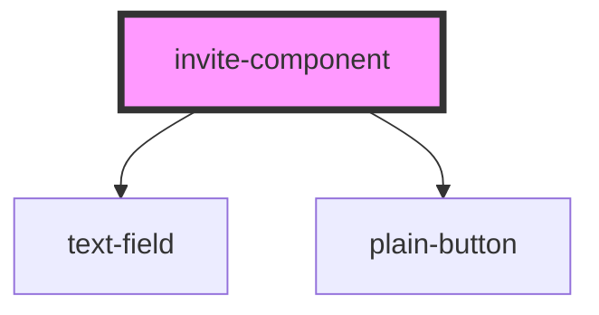

# invite-component

<!-- Auto Generated Below -->

## Properties

| Property | Attribute | Description | Type     | Default     |
| -------- | --------- | ----------- | -------- | ----------- |
| `apiurl` | `apiurl`  |             | `any`    | `undefined` |
| `url`    | `url`     |             | `string` | `undefined` |

## Dependencies

### Depends on

- [text-field](../text-field)
- [plain-button](../plain-button)

### Graph

----------------------------------------------

*Built with [StencilJS](https://stenciljs.com/)*
