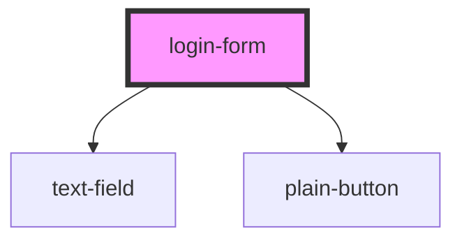

# login-form

<!-- Auto Generated Below -->

## Properties

| Property   | Attribute  | Description | Type     | Default |
| ---------- | ---------- | ----------- | -------- | ------- |
| `email`    | `email`    |             | `string` | `''`    |
| `error`    | `error`    |             | `string` | `''`    |
| `mode`     | `mode`     |             | `string` | `''`    |
| `password` | `password` |             | `string` | `''`    |
| `url`      | `url`      |             | `string` | `''`    |

## Dependencies

### Depends on

- [text-field](../../common/text-field)
- [plain-button](../../common/plain-button)

### Graph

----------------------------------------------

*Built with [StencilJS](https://stenciljs.com/)*
