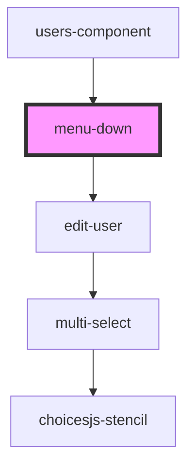

# menu-down

<!-- Auto Generated Below -->

## Properties

| Property | Attribute | Description | Type       | Default              |
| -------- | --------- | ----------- | ---------- | -------------------- |
| `email`  | `email`   |             | `string`   | `undefined`          |
| `option` | --        |             | `string[]` | `['delete', 'edit']` |
| `url`    | `url`     |             | `string`   | `undefined`          |
| `userId` | `user-id` |             | `number`   | `0`                  |

## Dependencies

### Used by

 - [users-component](../users-component)

### Depends on

- [edit-user](../edit-user)

### Graph

----------------------------------------------

*Built with [StencilJS](https://stenciljs.com/)*
