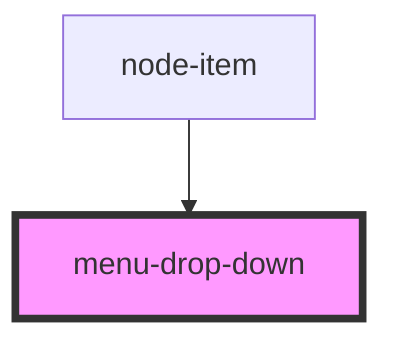

# menu-drop-down

<!-- Auto Generated Below -->

## Properties

| Property    | Attribute    | Description | Type       | Default     |
| ----------- | ------------ | ----------- | ---------- | ----------- |
| `list`      | --           |             | `string[]` | `undefined` |
| `listTitle` | `list-title` |             | `string`   | `undefined` |

## Dependencies

### Used by

 - [node-item](../node-item)

### Graph

----------------------------------------------

*Built with [StencilJS](https://stenciljs.com/)*
