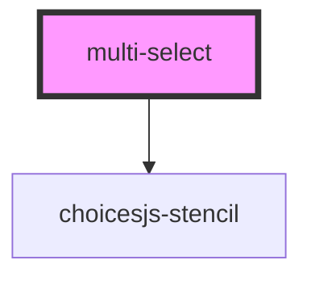

# my-component

<!-- Auto Generated Below -->

## Properties

| Property       | Attribute      | Description | Type         | Default     |
| -------------- | -------------- | ----------- | ------------ | ----------- |
| `handleselect` | `handleselect` |             | `any`        | `undefined` |
| `items`        | --             |             | `string[]`   | `undefined` |
| `roles`        | `roles`        |             | `any`        | `undefined` |
| `submiturl`    | `submiturl`    |             | `string`     | `""`        |
| `toggle`       | --             |             | `() => void` | `undefined` |
| `url`          | `url`          |             | `string`     | `undefined` |
| `userid`       | `userid`       |             | `number`     | `undefined` |
| `value`        | `value`        |             | `string`     | `undefined` |

## Dependencies

### Depends on

- choicesjs-stencil

### Graph

----------------------------------------------

*Built with [StencilJS](https://stenciljs.com/)*
