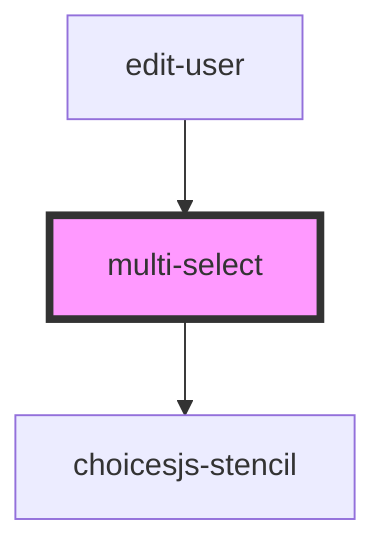

# my-component

<!-- Auto Generated Below -->

## Properties

| Property | Attribute | Description | Type     | Default     |
| -------- | --------- | ----------- | -------- | ----------- |
| `roles`  | `roles`   |             | `any`    | `undefined` |
| `url`    | `url`     |             | `string` | `undefined` |
| `userId` | `user-id` |             | `number` | `0`         |

## Dependencies

### Used by

 - [edit-user](../edit-user)

### Depends on

- choicesjs-stencil

### Graph

----------------------------------------------

*Built with [StencilJS](https://stenciljs.com/)*
