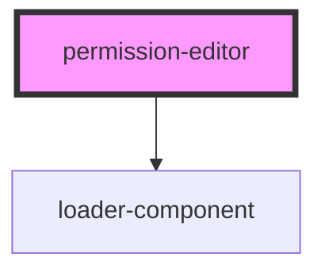

# permission-editor

<!-- Auto Generated Below -->

## Properties

| Property    | Attribute   | Description | Type     | Default     |
| ----------- | ----------- | ----------- | -------- | ----------- |
| `fetchrole` | `fetchrole` |             | `string` | `undefined` |
| `url`       | `url`       |             | `string` | `undefined` |

## Dependencies

### Depends on

- [loader-component](../loader-component)

### Graph

----------------------------------------------

*Built with [StencilJS](https://stenciljs.com/)*
