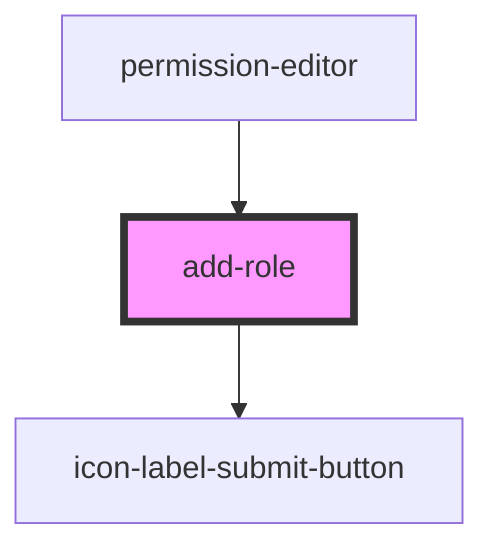

# add-role

<!-- Auto Generated Below -->

## Properties

| Property            | Attribute | Description | Type     | Default     |
| ------------------- | --------- | ----------- | -------- | ----------- |
| `parsedPermissions` | --        |             | `[]`     | `undefined` |
| `refresh`           | `refresh` |             | `any`    | `undefined` |
| `url`               | `url`     |             | `string` | `undefined` |

## Dependencies

### Used by

 - [permission-editor](../permission-editor)

### Depends on

- [icon-label-submit-button](../../common/buttons/icon-label-submit-button)

### Graph

----------------------------------------------

*Built with [StencilJS](https://stenciljs.com/)*
