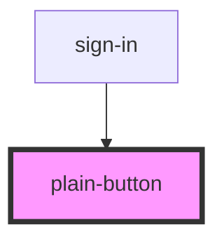

# plain-button

<!-- Auto Generated Below -->

## Properties

| Property   | Attribute   | Description | Type                        | Default       |
| ---------- | ----------- | ----------- | --------------------------- | ------------- |
| `addClass` | `add-class` |             | `string`                    | `''`          |
| `btnLabel` | `btn-label` |             | `string`                    | `undefined`   |
| `type`     | `type`      |             | `"contained" \| "outlined"` | `'contained'` |
| `width`    | `width`     |             | `"auto" \| "full"`          | `'auto'`      |

## Dependencies

### Used by

 - [sign-in](../sign-in)

### Graph

----------------------------------------------

*Built with [StencilJS](https://stenciljs.com/)*
