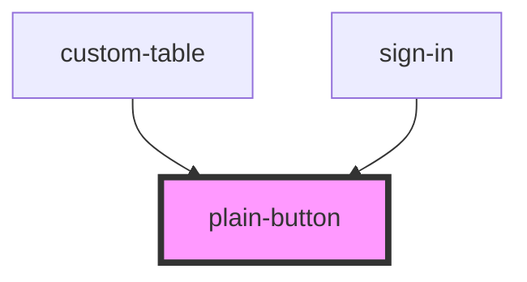

# plain-button

<!-- Auto Generated Below -->

## Properties

| Property          | Attribute          | Description | Type                                  | Default        |
| ----------------- | ------------------ | ----------- | ------------------------------------- | -------------- |
| `addClass`        | `add-class`        |             | `string`                              | `''`           |
| `clickHandler`    | `click-handler`    |             | `any`                                 | `undefined`    |
| `color`           | `color`            |             | `string`                              | `'indigo-600'` |
| `disabledHandler` | `disabled-handler` |             | `boolean`                             | `false`        |
| `hoverColor`      | `hover-color`      |             | `string`                              | `'indigo-700'` |
| `type`            | `type`             |             | `"contained" \| "outlined" \| "text"` | `'contained'`  |
| `width`           | `width`            |             | `"auto" \| "full"`                    | `'auto'`       |

## Dependencies

### Used by

 - [custom-table](../custom-table)
 - [sign-in](../sign-in)

### Graph

----------------------------------------------

*Built with [StencilJS](https://stenciljs.com/)*
