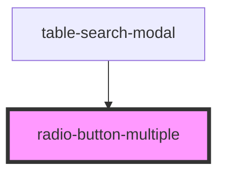

# radio-button-multiple

<!-- Auto Generated Below -->

## Properties

| Property       | Attribute       | Description | Type                         | Default        |
| -------------- | --------------- | ----------- | ---------------------------- | -------------- |
| `align`        | `align`         |             | `"horizontal" \| "vertical"` | `'horizontal'` |
| `checked`      | `checked`       |             | `string`                     | `undefined`    |
| `clickHandler` | `click-handler` |             | `any`                        | `undefined`    |
| `label`        | `label`         |             | `string`                     | `undefined`    |
| `labels`       | --              |             | `string[]`                   | `undefined`    |
| `name`         | `name`          |             | `string`                     | `undefined`    |

## Dependencies

### Used by

 - [table-search-modal](../table-search-modal)

### Graph

----------------------------------------------

*Built with [StencilJS](https://stenciljs.com/)*
