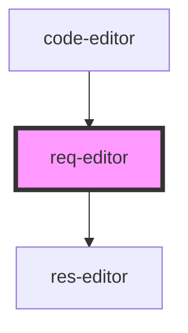

# code-editor

<!-- Auto Generated Below -->

## Properties

| Property | Attribute | Description | Type     | Default     |
| -------- | --------- | ----------- | -------- | ----------- |
| `doc`    | `doc`     |             | `any`    | `'\n\n'`    |
| `header` | `header`  |             | `string` | `undefined` |
| `url`    | `url`     |             | `string` | `undefined` |

## Dependencies

### Used by

 - [code-editor](../code-editor)

### Depends on

- [res-editor](../res-editor)

### Graph

----------------------------------------------

*Built with [StencilJS](https://stenciljs.com/)*
