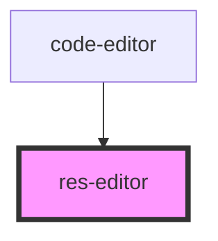

# res-editor

<!-- Auto Generated Below -->

## Properties

| Property | Attribute | Description | Type  | Default     |
| -------- | --------- | ----------- | ----- | ----------- |
| `doc`    | `doc`     |             | `any` | `undefined` |

## Dependencies

### Used by

 - [code-editor](../code-editor)

### Graph

----------------------------------------------

*Built with [StencilJS](https://stenciljs.com/)*
