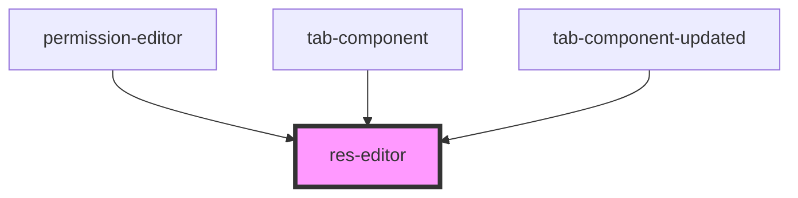

# res-editor

<!-- Auto Generated Below -->

## Properties

| Property        | Attribute        | Description | Type                  | Default     |
| --------------- | ---------------- | ----------- | --------------------- | ----------- |
| `doc`           | `doc`            |             | `any`                 | `undefined` |
| `responseLabel` | `response-label` |             | `"error" \| "result"` | `undefined` |

## Dependencies

### Used by

 - [permission-editor](../permission-editor)
 - [tab-component](../tab-component)
 - [tab-component-updated](../tab-component-updated)

### Graph

----------------------------------------------

*Built with [StencilJS](https://stenciljs.com/)*
